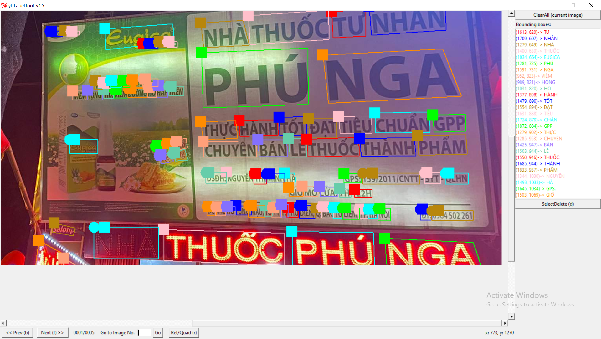

# Vietnamese-scene-text-recognition

This is the solution that ranked 6th in [AI Challenge HCM 2021](https://aichallenge.hochiminhcity.gov.vn)

## Table of content
### [Vietnamese-scene-text-recognition](#vietnamese-scene-text-recognition)
### [Dataset](#dataset)
- [VinTextV2](#vintextv2)
- [Add your own dataset](#add-your-own-dataset)
### [Detection](#detection)
- [Requirements](#requirements)
- [Installation](#installation)
### [Run on Ubuntu or Windows](#run-on-ubuntu-or-windows)
### [Run on Docker](#run-on-docker)
##### [Training and Evaluation](#training-and-evaluation)
- [Training](#training)
- [Evaluation](#evaluation)
##### [Acknowledgement](#acknowledgement)
### [Recognition](#recognition)
- [Installation](#installation-1)
- [Dataset](#dataset-1)
- [Getting started](#getting-started)
- [Acknowledgement](#acknowledgement-1)
  

### Dataset

We use a dataset based on [VinText dataset](https://www3.cs.stonybrook.edu/~minhhoai/papers/vintext_CVPR21.pdf) combine with different picture we found on google. 

|    Name  						  | #imgs | #text instances						   | Examples 									|
|:-------------------------------:|:-----:|:-----------------------------------|:----------------------------------:|
|VinTextV2| 3800  | About 92000 			   ||


|    Dataset variant  						  | Input format |  Link download 									|
|:-------------------------------:|:-----:|:----------------------------------:|
|Original| x1,y1,x2,y2,x3,y3,x4,y4,TRANSCRIPT  |[Download here](https://drive.google.com/file/d/1UUQhNvzgpZy7zXBFQp0Qox-BBjunZ0ml/view?usp=sharing)|
|Converted dataset| [COCO format](https://cocodataset.org/#format-data)  |[Download here](https://drive.google.com/file/d/1AXl2iOTvLtMG8Lg2iU6qVta8VuWSXyns/view?usp=sharing)|
#### VinTextV2
Extract data and copy folder to folder ```Vietnamese-Language-Detection-and-Recognition/Detection/datasets/```

```
datasets
└───vintext
	└───test.json
		│train.json
		|train_images
		|test_images
└───evaluation
	└───gt_vintext.zip
```
---
#### Add your own dataset
You can download our label tool [here](https://drive.google.com/drive/folders/1XcUnjJ2eOcXM0JOlYjAVQnnKP2Xx8FHV?usp=sharing)


## Detection

##### Requirements

- python=3.7
- torch==1.8.0

##### Installation

```sh
conda create -n fb -y python=3.7
conda activate fb

#for CPU users
conda install pytorch==1.8.0 torchvision==0.9.0 torchaudio==0.8.0 cpuonly -c pytorch
#for GPU users
conda install pytorch=1.8.0 torchvision=0.9.0 cudatoolkit=11.1 -c pytorch -c conda-forge

python -m pip install ninja yacs cython matplotlib tqdm opencv-python shapely scipy tensorboardX pyclipper Polygon3 weighted-levenshtein editdistance

# Install Detectron2
python -m pip install 'git+https://github.com/facebookresearch/detectron2.git'
```
#### Check out the code and install: 
```sh
git clone https://github.com/Ton2808/Vietnamese-Language-Detection-and-Recognition.git
cd Vietnamese-Language-Detection-and-Recognition
python setup.py build develop
```

##### Download vintext pre-trained model

- [trained_model](https://drive.google.com/file/d/15rJsQCO1ewJe-EInN-V5dSCftew4vLRz/view?usp=sharing).

##### Usage

#### Run on Ubuntu or Windows

Prepare folders
```sh
mkdir sample_input
mkdir sample_output
```
Copy your images to ```sample_input/```. Output images would result in ```sample_output/```
```sh
python demo/demo.py --config-file configs/BAText/VinText/attn_R_50.yaml --input data/test_data --output sample_output/ --opts MODEL.WEIGHTS ./save_models/bbox.pth
```
|  |
|:--:|
| *Qualitative Results on VinText.*|

#### Run on Docker

Download and unzip FantasticBeasts.zip
- [FantasticBeasts.zip](https://drive.google.com/file/d/10qYIcp8HIukuwPMnvpoWN7wTmQgXzm7p/view?usp=sharing).

```sh
unzip FantasticBeasts.zip
cd FantasticBeasts/Docker
```

Open Docker and load docker images
```sh
#for CPU users
docker load fantasticbeasts-aic-cpu.tar

#for GPU users with NIVIDA docker toolkit
docker load fantasticbeasts-aic-gpu.tar
```

Create folders and copy the path
```sh
mkdir test_data
mkdir submission_output
```

Run Docker images
```sh
#for CPU users
docker run --mount type=bind,source=[test_data_folder_path],target=/home/ml/AIC/aicsolution/data/test_data --mount type=bind,source=[submission_output_folder_path],target=/home/ml/AIC/aicsolution/data/submission_output [IMAGE ID] /bin/bash run.sh

#for GPU users with NIVIDA docker toolkit
nvidia-docker run -it --rm --gpus all --mount type=bind,source=[test_data_folder_path],target=/home/ml/AIC/aicsolution/data/test_data --mount type=bind,source=[submission_output_folder_path],target=/home/ml/AIC/aicsolution/data/submission_output [image ID] /bin/bash run.sh
```

#### Training and Evaluation


##### Training

For training, we employed the pre-trained model [tt_attn_R_50](https://cloudstor.aarnet.edu.au/plus/s/tYsnegjTs13MwwK/download) from the ABCNet repository for initialization.

```sh
python tools/train_net.py --config-file configs/BAText/VinText/attn_R_50.yaml MODEL.WEIGHTS path_to_tt_attn_R_50_checkpoint
```

Example:
```sh
python tools/train_net.py --config-file configs/BAText/VinText/attn_R_50.yaml MODEL.WEIGHTS ./tt_attn_R_50.pth
```

Trained model output will be saved in the folder ```output/batext/vintext/``` that is then used for evaluation

##### Evaluation

```sh
python tools/train_net.py --eval-only --config-file configs/BAText/VinText/attn_R_50.yaml MODEL.WEIGHTS path_to_trained_model_checkpoint
```
Example:
```sh
python tools/train_net.py --eval-only --config-file configs/BAText/VinText/attn_R_50.yaml MODEL.WEIGHTS ./output/batext/vintext/trained_model.pth
```
#### Acknowledgement
This repository is built based-on [ABCNet](https://github.com/aim-uofa/AdelaiDet/blob/master/configs/BAText)

## Recognition
Using TransformerOCR
##### Installation
- pip install vietocr==0.3.7
##### Dataset
Extract data and copy folder to folder ```Vietnamese-Language-Detection-and-Recognition/recognition/dataset/```

```
datasets
└───train
└───valid
│train.txt
|valid.txt
```
---
##### Getting started
- Using detection result in detection task. Then cut out the bounding box picture to train and predict.

Followed this [Jupiter Notebook](https://github.com/Ton2808/Vietnamese-Language-Detection-and-Recognition/blob/main/Recognition/Train_AIC_vocr-2.ipynb) for quick start. 
#### Acknowledgement
This repository is built based-on [VietOCR](https://github.com/pbcquoc/vietocr)
